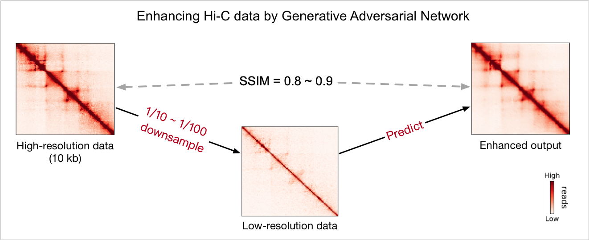

# DeepHiC: A Generative Adversarial Network for Enhancing Hi-C Data Resolution

We provide the PyTorch implementations for both predicting and training procedures.

## Summary

DeepHiC is a deep learning model developed for boosting the resolution of Hi-C data. It is based on [Generative Adversarial Network](https://arxiv.org/abs/1406.2661). It takes low-resolution data as conditional inputs for *Generator* Net in GAN and outputs the enhanced Hi-C matrices.

We trained DeepHiC for 300 epochs on chromosome 1-14 in the GM12878 cell line from [Rao's HiC](https://www.ncbi.nlm.nih.gov/geo/query/acc.cgi?acc=GSE63525) and evaluated on remaining data including other two cell lines' data (IMR90, K562).

> The framework of DeepHiC. With 10kb high-resolution data as the ground truth, DeepHiC predicts enhanced outputs from low-resolution Hi-C data (1/10 - 1/100 randomly downsampled reads). The structure similarity index (SSIM) between enhanced outputs and real 10-kb high-resolution data achieves 0.8 (1% reads) to 0.9 (4% reads) on average.

## Dependency

DeepHiC is written in Python3 with PyTorch framework. It demands Python version 3.6+

Other python packages used in this repo (version numbers are recommanded):

- pytorch 1.1.0 (www.pytorch.org)
- torchvision 0.3.0
- numpy 1.16.4
- scipy 1.3.0
- pandas 0.24.2
- scikit-learn 0.21.2
- matplotlib 3.1.0
- tqdm 4.32.2
- visdom 0.1.8.8

> Note: 1. visdom must be runned in background
>       2. GPU acceleration is strongly recommended.

## Data Preparation

### 1. Raw data

We used [Rao's HiC](https://www.ncbi.nlm.nih.gov/geo/query/acc.cgi?acc=GSE63525) data from GEO. Take the [data](https://www.ncbi.nlm.nih.gov/geo/download/?acc=GSE63525&format=file&file=GSE63525%5FGM12878%5Fprimary%5Fintrachromosomal%5Fcontact%5Fmatrices%2Etar%2Egz) in GM12878 cell line as example.

The string variable `root_dir` defined in `all_parser.py` determines the directory storing all raw and processed data.

Here we unzip Hi-C data into `/data/RaoHiC/raw/GM12878`. `root_dir` could be customized according to the folder path you store data. But raw data must be putted in `$root_dir/raw/[cell_line_name]`

### 2. Processed data

We also uploaded the [processed data](https://www.dropbox.com/sh/5b5thuk62px5qpk/AAAKc7NDUL6JId63tlBH5X9ua?dl=0) for training our model, and the processed data in GM12878 replicate which could be predicted directly. Just move the `data` folder to `$root_dir/data`.

## Usage

### 1. Data Preprocessing

Taking the GM12878 cell line data for example. Raw data is stored in directory: `$root_dir/raw/GM12878`

1. Reading raw data and storing Hi-C matrices as np.ndarrays in .npz format.

~~~bash
python data_aread.py -c GM12878
~~~

> Note: We only provide the script for parsing Rao's data. If you are using different types of Hi-C data, please replace them with yours.

> Note: currently, we also provided a script for convert HiC-Pro output to our input in `./scripts/hicpro2deephic.py`. the chrN_10kb.npz files for one cell line data should be putted in `$root_dir/mat/[cell_line_name]`

> Note: except for Hi-C matrices, we also stored the index of bins whose sum greater than zero for each chromosome, a.k.a variable `compact` in the same .npz file

2. Randomly downsampling to 1/16 reads.

~~~bash
python data_downsample.py -hr 10kb -lr 40kb -r 16 -c GM12878
~~~

-  `-hr`: the resolution of high-resolution data
-  `-lr`: the low-resolution (just for convenience) for downsampled data, e.g. I named 1/16 downsampled data as `chrN_40kb.npz`
-  `-r` : the downsampling factor
-  `-c` : cell_line_name of data

3. Generating trainable/predictable data

~~~bash
python data_generate.py -hr 10kb -lr 40kb -s all -chunk 40 -stride 40 -bound 201 -scale 1 -c GM12878
~~~

-  `-hr`: the high-resolution data we used for train
-  `-lr`: the low-coverage (downsampled) data we used for training input
-  `-s` : specifying dataset: train/test/human/mouse
-  `-chunk`: chunk size for each small samples
-  `-stride`: should be same with `-chunk`
-  `-bound`: upper bound of genomic distance, e.g. 201 means 200 x 10kb
-  `-scale`: whether to pooling input matrices, current version is no, it should be 1 in default.
-  `-c` : cell_line_name of data

### 2. Traning or Predicting

1. For training purpose

~~~bash
python train.py
~~~

2. For predicting purpose

~~~bash
python data_predict.py -lr 40kb -ckpt save/a_suitable_parameter_file.pytorch -c GM12878
~~~

-  `-lr`: the low-coverage (downsampled) data we used for input
-  `-ckpt` : trained parameters
-  `-c` : cell_line_name of data
